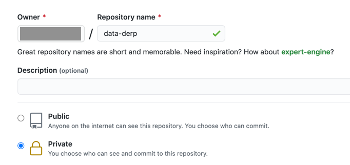

# Data Derp
This repository contains the practical exercise of the Data Derp training. It contains the following relevant modules:
* base
   * .tf files for the creation of an AWS S3 bucket where ingested/transformed files will live
* data-ingestion
   * /src - source code
   * /tests - tests
   * .tf files for the creation of the AWS Glue job 
* data-transformation
   * /src - source code
   * /tests - tests
   * .tf files for the creation of the AWS Glue job
* data-analytics
   * An empty Jupyter Notebook
* data-streaming
   * .dbc files for practice with streaming
* bootstrap
   * Cloudformation template that creates a VPC, Githubrunner (requires a Github Personal Access Token), Terraform Remote State S3 bucket

## Quickstart
1. [Duplicate this repo](#mirror-the-repository) in your account as a **PRIVATE** repo (since you're running your own self-hosted GithubRunners, you'll want to ensure your project is Private)
2. Set up your [Development Environment](./development-environment.md)
3. [Bootstrap the AWS Dependencies](./bootstrap/README.md): `./data-derp aws-deps -p <project-name> -m <module-name> -u <github-username>`
   * :bulb: you will need valid AWS credentials. See the [README](./bootstrap/README.md).
   * the `project-name` and `module-name` must be globally unique as an AWS S3 bucket is created (this resource is globally unique) 
4. Create a Github workflow: `./data-derp setup-workflow -p <project-name> -m <module-name>`
   * The `project-name` and `module-name` must be the same as step (3)

## Mirror the Repository
1. Create a **PRIVATE** repo called `data-derp` in your Github account

   
2. Duplicate this repo and push to your new private repo:
```bash
git clone --bare git@github.com:kelseymok/data-derp.git
cd data-derp.git # Yes, with the .git
git push --mirror git@github.com:<your-username>/data-derp.git
git remote set-url origin git@github.com:<your-username>/data-derp.git
```

## Working in Python
In VS with the Remote Container (see [Development Environment](./development-environment.md)), there are **three** options to running Python code:
1. Open any .py file and use the green Play button towards the top-right corner
2. From your terminal run `python <your_path.py>`
3. Create a new .ipynb file and start experimenting with an interactive notebook

## Testing in Python
1. `python -m pytest` from the root of the repository if you want to test all modules/exercises
2. Otherwise, cd into the relevant directory and run `python -m pytest`
3. You can also open any of the test_xxx.py files (e.g. `test_transformation.py`) and hit the Play button
4. To test an individual **test function** run `python -m pytest <path_to_test_xxx.py> -k <name_of_test_function>`

## Troubleshooting
Sometimes pytest might not detect changes in your data-ingestion and data-transformation libraries. In those cases:
    - **View** > **Command Palette...**. Type **Remote-Containers: Rebuild Container**

## Tips & Tricks
1. To get the full path to any file, simply right-click on it and choose **Copy Path**
2. If you have too many tabs open and want to close them, right-click on the tab and choose either **Close Others** or **Close All**
3. Once the Python extension is installed: for any .py file, you should be able to click on the green ▷ button towards the top right corner to run your script
4. You can also run/create interactive notebooks (the file name just needs to end with `.ipynb`). You'll even have IntelliSense thanks to Pylance!
5. We've set the theme for interactive notebooks to **Light Mode** for easier viewing over video calls. If you'd like to change it back to the default **Dark Mode**:
    - go to `.devcontainer/devcontainer.json` and remove the line `"jupyter.ignoreVscodeTheme": true,`
    - do the same for `.vscode/settings.json`
6. If you *really* prefer the original Jupyter:
    - type `jupyter lab --allow-root` into the VS Code terminal
    - the terminal should now output a few URLs on port 8888, each containing a token
    - **⌘ + click** any of those URLs (try both if needed)
